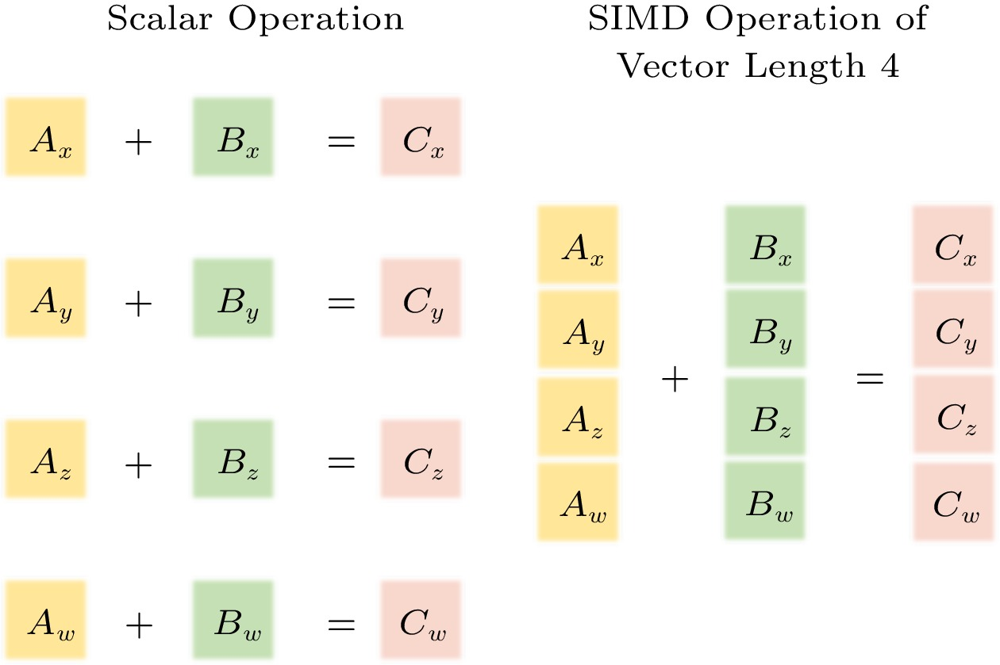

# Acelerando .NET Usando SIMD

## O Que é SIMD?

SIMD significa _Single Instruction, Multiple Data_ (Instrução Única, Múltiplos Dados), uma técnica de computação que
permite executar a mesma operação em vários pontos de dados simultaneamente.

Desta forma:

- Uma única instrução opera sobre vários valores;
- As instruções SIMD podem processar mais de um escalar em uma **única** instrução;
- Abaixo, ao invés de usar 4 instruções, uma única instrução faz a soma do vetor inteiro de uma vez;
- Objetivo é extrair paralelismo no nível de dados, diminuindo o tempo de execução.

 \
_Fonte_: JCST, Journal of Computer Science and Technology.

Essa abordagem aumenta significativamente a velocidade e a eficiência ao processar vários pontos de dados em paralelo,
em vez de um de cada vez. Processadores que suportam este recurso estão usando **paralelismo no nível dos dados** (há
computações simultâneas paralelas), porém cada unidade computacional executa exatamente a mesma instrução de máquina em
um dado momento. Portanto, não confundir com
[processamento concorrente](https://en.wikipedia.org/wiki/Concurrent_computing).

O SIMD é particularmente eficaz para tarefas que envolvem cálculos repetitivos, como processamento de imagens ou
simulações científicas. Ele se baseia em instruções especializadas que permitem às CPUs e GPUs lidar com vários pontos
de dados ao mesmo tempo, otimizando o desempenho ao reduzir o número de ciclos necessários para a execução.

## Por que usar SIMD? Por que paralelizar?

A resposta para estas perguntas é a mais direta possível.

- A vantagem de usar o processamento paralelo é, de fato, reduzir o tempo necessário para processar tarefas longas;
- Reduzir o tempo de processamento de meses para semanas; de horas para minutos; de minutos para segundos;
- Melhorar a experiência do usuário ao diminuir o tempo de espera por resultados.

## Um Estudo de Caso

É relativamente simples encontrar na internet vários artigos que alegam ganhos substanciais no desempenho de aplicações
que utilizam SIMD. Boa parte das linguagens tem incluído o suporte a SIMD em seus recursos, como por exemplo, o `C`, o
`rust` e o `.NET`

Para avaliar se podemos realmente obter ganhos relevantes em programas .NET, este artigo se propõe a criar um caso de
teste que embora seja limitado no alcance, demonstre um caso de uso real.

### O Experimento

Criamos um laço for para realizar a soma de itens de uma matriz (um caso clássico de uso de matrizes em `C#`). Eis o
código fonte usado no nosso experimento:

- Principal.cs (o programa principal):

```C#
using System.Runtime.Intrinsics.X86;

using BenchmarkDotNet.Running;

namespace SIMDPerformance
{
    class Program
    {
        static void Main(string[] args)
        {
            if (!Avx2.IsSupported)
            {
                Console.WriteLine("AVX2 NOT supported pela sua CPU!");
                return;
            }
            var summary = BenchmarkRunner.Run<SIMDAVX2Performance>();
        }
    }
}
```

- SIMDPerformance.cs (a classe em que será feita a medição de desempenho):

```C#
// #######################################################################
// Copyright Claudio André <portfolio-2025br at claudioandre.slmail.me>
//               ____              __
//              / __ )____  ____  / /__________ _____ ___  ____
//             / __  / __ \/ __ \/ __/ ___/ __ `/ __ `__ \/ __ \
//            / /_/ / /_/ / /_/ / /_/ /__/ /_/ / / / / / / /_/ /
//           /_____/\____/\____/\__/\___/\__,_/_/ /_/ /_/ .___/
//                                                 /_/
// This program comes with ABSOLUTELY NO WARRANTY; express or implied.
//
// This program is free software: you can redistribute it and/or modify
// it under the terms of the GNU General Public License 2.0
// #######################################################################
using System.Numerics;
using System.Runtime.InteropServices;
using System.Runtime.Intrinsics;
using System.Runtime.Intrinsics.X86;

using BenchmarkDotNet.Attributes;

namespace SIMDPerformance
{
    [MemoryDiagnoser]
    public class SIMDAVX2Performance
    {
        // (12345 * Vector256<int>.Count);
        private const int ITEMS = 12345 * 8;
        private static int[] left = new int[ITEMS];
        private static int[] right = new int[ITEMS];
        private static int[] resultado = new int[ITEMS];

        [GlobalSetup]
        public void GlobalSetup()
        {
            //Inicialização dos arrays
            for (int i = 0; i < ITEMS; i++)
            {
                left[i] = i;
                right[i] = i + Environment.Version.Major;
            }
        }

        [Benchmark]
        public void SimplesSomaArray()
        {
            // O processador está somando 1 (UM) inteiro por vez
            for (int i = 0; i < left.Length; i++)
                resultado[i] = left[i] + right[i];
        }

        [Benchmark(Baseline = true)]
        public void SIMDSomaArray()
        {
            Span<Vector256<int>> leftVectors =
                MemoryMarshal.Cast<int, Vector256<int>>(left);
            Span<Vector256<int>> rightVectors =
                MemoryMarshal.Cast<int, Vector256<int>>(right);
            Span<Vector256<int>> outputVectors =
                MemoryMarshal.Cast<int, Vector256<int>>(resultado);

            // O processador está somando 8 (OITO) inteiros de uma vez
            for (int i = 0; i < leftVectors.Length; i++)
                outputVectors[i] =
                    Avx2.Add(leftVectors[i], rightVectors[i]);
        }
    }
}
```

### Os Resultados

De fato, nós conseguimos comprovar um ganho superior a 5 (cinco) vezes no desempenho de uma aplicação cujo propósito é
fazer uma soma de elementos de um Array.

Como pode ser visto abaixo, usamos a últimas versões LTS tanto do Ubuntu quanto do .NET em um processador AMD
relativamente recente (para os padrões brasileiros).

```sh

BenchmarkDotNet v0.15.1, Linux Ubuntu 24.04.2 LTS (Noble Numbat)
AMD Ryzen 5 3500U with Radeon Vega Mobile Gfx 2.10GHz, 1 CPU, 8 logical and 4 physical cores
.NET SDK 8.0.116
  [Host]     : .NET 8.0.16 (8.0.1625.21506), X64 RyuJIT AVX2
  DefaultJob : .NET 8.0.16 (8.0.1625.21506), X64 RyuJIT AVX2

```

| Method           |      Mean |    Error |   StdDev | Ratio | RatioSD | Allocated | Alloc Ratio |
| ---------------- | --------: | -------: | -------: | ----: | ------: | --------: | ----------: |
| SimplesSomaArray | 111.80 μs | 0.946 μs | 0.839 μs |  5.24 |    0.20 |         - |          NA |
| SIMDSomaArray    |  21.37 μs | 0.424 μs | 0.847 μs |  1.00 |    0.05 |         - |          NA |

## Próximos Passos

Nas versões 8 e superiores o .NET suporta AVX-512 (o próximo nível SIMD para CPUs X86); particularmente de interesse
para o nosso exemplo, suporta o método `Avx512BW.Add()`. Ao adaptar o código fonte deste estudo de caso para usar
`Vector512<int>` se espera um ganho de performance próximo de 100%, isto baseado na experiência de outras ferramentas
escritas em `C` que já realizaram adaptação semelhante.

É possível obter acesso a hardware que suporta AVX-512 usando provedores de nuvem pública. Várias CPUs Intel Xeon
disponíveis nestes provedores já dispõem de AVX-512. Porém, no segmento Desktop a disponibilidade de CPUs é muito mais
restrita e os custos bastante proibitivos. Por exemplo, a
[CPU Intel i9-10980XE](https://www.intel.com.br/content/www/br/pt/products/sku/198017/intel-core-i910980xe-extreme-edition-processor-24-75m-cache-3-00-ghz/specifications.html)
oferece AVX-512 para o universo Desktop por um preço sugerido superior a mil dolares por unidade para clientes da Intel.
